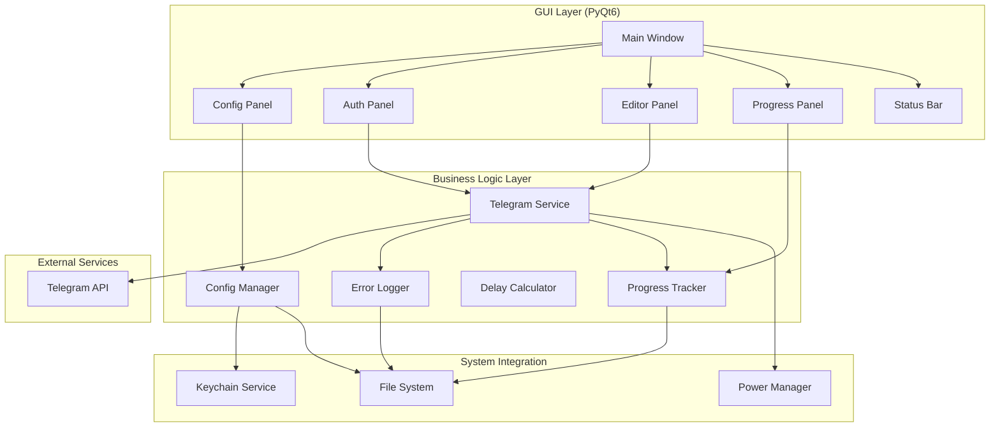
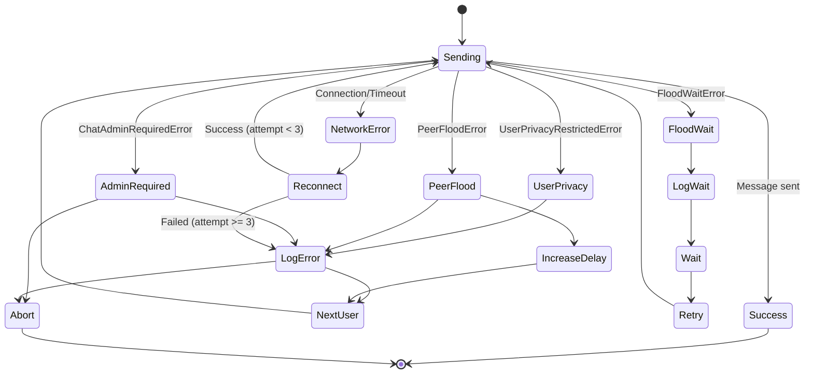

# Документ Дизайна: Telegram Mailer MacOS App

## Обзор

Telegram Mailer MacOS App - это нативное MacOS приложение, которое упаковывает существующий Python-скрипт для массовой рассылки в Telegram в удобный .app bundle с графическим интерфейсом. Приложение использует PyInstaller для создания standalone исполняемого файла, включающего Python runtime и все зависимости.

### Ключевые Технологии

- **Python 3.11+**: Основной язык программирования
- **Telethon**: Библиотека для работы с Telegram API
- **PyQt6**: Современный GUI фреймворк с нативным внешним видом MacOS
- **PyInstaller**: Инструмент для упаковки Python приложений в .app bundle
- **asyncio**: Асинхронное выполнение для неблокирующих операций
- **keyring**: Безопасное хранение учетных данных через MacOS Keychain
- **caffeinate API**: Предотвращение режима сна MacOS

### Архитектурные Принципы

1. **Разделение ответственности**: Четкое разделение между бизнес-логикой (Telethon), UI (PyQt6) и управлением состоянием
2. **Асинхронность**: Все операции с Telegram выполняются асинхронно, чтобы не блокировать UI
3. **Персистентность**: Все критичные данные (прогресс, сессия, конфигурация) сохраняются на диск
4. **Отказоустойчивость**: Автоматическое восстановление после сбоев сети и ошибок API
5. **Безопасность**: Чувствительные данные шифруются через MacOS Keychain

## Архитектура

### Компонентная Диаграмма



### Поток Данных

1. **Инициализация**: App Bundle → Config Manager → Keychain/FileSystem
2. **Аутентификация**: Auth Panel → Telegram Service → Telegram API → Session File
3. **Подготовка Рассылки**: Editor Panel → Delay Calculator → Progress Tracker
4. **Выполнение Рассылки**: Telegram Service → Telegram API → Progress Tracker → Error Logger
5. **Мониторинг**: Progress Tracker → Progress Panel → Status Bar

## Компоненты и Интерфейсы

### 1. Main Window (PyQt6 QMainWindow)

Главное окно приложения, координирующее все панели и управляющее жизненным циклом приложения.

**Интерфейс:**
```python
class MainWindow(QMainWindow):
    def __init__(self):
        """Инициализация главного окна и всех панелей"""
        
    def setup_ui(self) -> None:
        """Настройка UI компонентов и layout"""
        
    def load_window_geometry(self) -> None:
        """Загрузка сохраненного размера и позиции окна"""
        
    def save_window_geometry(self) -> None:
        """Сохранение размера и позиции окна"""
        
    def closeEvent(self, event: QCloseEvent) -> None:
        """Обработка закрытия окна с подтверждением при активной рассылке"""
```

### 2. Config Manager

Управляет конфигурацией приложения, включая API ключи и настройки.

**Интерфейс:**
```python
class ConfigManager:
    def __init__(self, config_dir: Path):
        """Инициализация с директорией конфигурации"""
        
    def load_config(self) -> Dict[str, Any]:
        """Загрузка конфигурации из JSON файла"""
        
    def save_config(self, config: Dict[str, Any]) -> None:
        """Сохранение конфигурации в JSON файл"""
        
    def get_api_credentials(self) -> Tuple[str, str]:
        """Получение API_ID и API_HASH из Keychain"""
        
    def save_api_credentials(self, api_id: str, api_hash: str) -> None:
        """Сохранение API_ID и API_HASH в Keychain"""
        
    def validate_credentials(self, api_id: str, api_hash: str) -> bool:
        """Валидация учетных данных (непустые строки)"""
```

**Хранение Данных:**
- Конфигурационный файл: `~/Library/Application Support/TelegramMailer/config.json`
- Формат:
```json
{
    "window_geometry": {"x": 100, "y": 100, "width": 800, "height": 600},
    "last_group_url": "https://t.me/...",
    "batch_size": 18
}
```
- API_HASH хранится в MacOS Keychain через библиотеку `keyring`

### 3. Telegram Service

Основной сервис для взаимодействия с Telegram API через Telethon.

**Интерфейс:**
```python
class TelegramService:
    def __init__(self, api_id: str, api_hash: str, session_dir: Path):
        """
        Инициализация Telethon клиента
        
        Args:
            api_id: Telegram API ID
            api_hash: Telegram API Hash
            session_dir: Директория для хранения session файлов
        """
        self.client = TelegramClient(
            str(session_dir / 'session_name'),
            api_id,
            api_hash
        )
        self.is_connected = False
        self.reconnect_attempts = 0
        
    async def connect(self) -> None:
        """
        Подключение к Telegram
        
        Raises:
            ConnectionError: Если не удалось подключиться
        """
        await self.client.connect()
        self.is_connected = True
        
    async def disconnect(self) -> None:
        """
        Корректное отключение от Telegram
        Сохраняет сессию и закрывает соединение
        """
        if self.is_connected:
            await self.client.disconnect()
            self.is_connected = False
        
    async def is_authorized(self) -> bool:
        """
        Проверка авторизации пользователя
        
        Returns:
            bool: True если пользователь авторизован
        """
        return await self.client.is_user_authorized()
        
    async def send_code_request(self, phone: str) -> str:
        """
        Запрос кода аутентификации от Telegram
        
        Args:
            phone: Номер телефона в международном формате (+7...)
            
        Returns:
            str: Phone code hash для последующей аутентификации
            
        Raises:
            PhoneNumberInvalidError: Если номер телефона невалиден
        """
        result = await self.client.send_code_request(phone)
        return result.phone_code_hash
        
    async def sign_in(
        self, 
        phone: str, 
        code: str, 
        phone_code_hash: str,
        password: str = None
    ) -> bool:
        """
        Вход с кодом аутентификации и опциональным паролем 2FA
        
        Args:
            phone: Номер телефона
            code: Код из SMS/Telegram
            phone_code_hash: Hash из send_code_request
            password: Пароль 2FA (если включен)
            
        Returns:
            bool: True если аутентификация успешна
            
        Raises:
            PhoneCodeInvalidError: Если код неверный
            SessionPasswordNeededError: Если требуется пароль 2FA
            PasswordHashInvalidError: Если пароль 2FA неверный
        """
        try:
            await self.client.sign_in(phone, code, phone_code_hash=phone_code_hash)
            return True
        except SessionPasswordNeededError:
            if password:
                await self.client.sign_in(password=password)
                return True
            else:
                raise
        
    async def get_group_members(self, group_url: str) -> List[User]:
        """
        Получение списка участников группы
        
        Args:
            group_url: URL группы (https://t.me/...)
            
        Returns:
            List[User]: Список участников группы
            
        Raises:
            ValueError: Если URL группы невалиден
            ChatAdminRequiredError: Если нет прав доступа
            InviteHashExpiredError: Если ссылка-приглашение истекла
        """
        try:
            # Парсинг URL и получение entity
            entity = await self.client.get_entity(group_url)
            
            # Получение участников
            participants = await self.client.get_participants(entity)
            
            # Конвертация в User модель
            users = []
            for participant in participants:
                user = User(
                    id=participant.id,
                    username=participant.username,
                    first_name=participant.first_name,
                    last_name=participant.last_name,
                    sent=False
                )
                users.append(user)
                
            return users
            
        except ValueError as e:
            raise ValueError(f"Невалидный URL группы: {group_url}") from e
        
    async def send_message(
        self, 
        user_id: int, 
        message: str,
        delay_min: int = 15,
        delay_max: int = 45
    ) -> SendResult:
        """
        Отправка сообщения пользователю с случайной задержкой
        
        Args:
            user_id: Telegram ID пользователя
            message: Текст сообщения (может содержать HTML)
            delay_min: Минимальная задержка в секундах (по умолчанию 15)
            delay_max: Максимальная задержка в секундах (по умолчанию 45)
            
        Returns:
            SendResult: Результат отправки с информацией об успехе/ошибке
            
        Note:
            Автоматически добавляет случайную задержку после отправки
        """
        try:
            # Отправка сообщения с HTML парсингом
            await self.client.send_message(
                user_id, 
                message, 
                parse_mode='html'
            )
            
            # Случайная задержка для имитации человеческого поведения
            delay = random.randint(delay_min, delay_max)
            await asyncio.sleep(delay)
            
            return SendResult(
                success=True,
                user_id=user_id
            )
            
        except FloodWaitError as e:
            # Telegram требует подождать
            return SendResult(
                success=False,
                user_id=user_id,
                error=f"FloodWait: {e.seconds} секунд",
                retry_after=e.seconds
            )
            
        except UserPrivacyRestrictedError:
            # Настройки приватности пользователя
            return SendResult(
                success=True,  # Считаем "успешным" чтобы не повторять
                user_id=user_id,
                error="UserPrivacyRestricted"
            )
            
        except PeerFloodError:
            # Слишком много запросов
            return SendResult(
                success=False,
                user_id=user_id,
                error="PeerFlood: Слишком много запросов"
            )
            
        except Exception as e:
            # Другие ошибки
            return SendResult(
                success=False,
                user_id=user_id,
                error=str(e)
            )
        
    async def reconnect(self, max_attempts: int = 3) -> bool:
        """
        Переподключение при сетевых ошибках
        
        Args:
            max_attempts: Максимальное количество попыток
            
        Returns:
            bool: True если переподключение успешно
        """
        for attempt in range(max_attempts):
            try:
                await self.disconnect()
                await asyncio.sleep(5)  # Пауза перед переподключением
                await self.connect()
                
                if await self.is_authorized():
                    self.reconnect_attempts = 0
                    return True
                    
            except Exception as e:
                self.reconnect_attempts += 1
                if attempt == max_attempts - 1:
                    return False
                await asyncio.sleep(10)  # Увеличенная пауза между попытками
                
        return False
```

**Детали Реализации:**

1. **Инициализация:**
   - Создает TelegramClient с указанным session файлом
   - Session файл сохраняется автоматически Telethon
   - Поддерживает переиспользование сессии между запусками

2. **Аутентификация:**
   - Двухэтапный процесс: send_code_request → sign_in
   - Поддержка 2FA через опциональный параметр password
   - Автоматическое сохранение сессии после успешной аутентификации

3. **Получение Участников:**
   - Парсит URL группы (поддерживает t.me ссылки и username)
   - Получает полный список участников через get_participants
   - Конвертирует в User модель для удобства

4. **Отправка Сообщений:**
   - Поддержка HTML форматирования (parse_mode='html')
   - Автоматическая случайная задержка после каждого сообщения
   - Детальная обработка всех типов ошибок Telegram
   - Возвращает структурированный результат SendResult

5. **Переподключение:**
   - Автоматические попытки при сетевых сбоях
   - Экспоненциальная задержка между попытками
   - Проверка авторизации после переподключения

**Обработка Ошибок:**
- `UserPrivacyRestrictedError`: Логируется, пользователь помечается как обработанный
- `PeerFloodError`: Увеличивается задержка, логируется
- `FloodWaitError`: Ожидание указанного времени + случайная задержка
- `ChatAdminRequiredError`: Логируется, рассылка прерывается
- Сетевые ошибки: Автоматическое переподключение до 3 попыток

### 4. Text Editor Panel

Встроенный текстовый редактор с поддержкой форматирования.

**Интерфейс:**
```python
class TextEditorPanel(QWidget):
    def __init__(self):
        """Инициализация редактора"""
        
    def setup_toolbar(self) -> None:
        """Создание панели инструментов форматирования"""
        
    def apply_bold(self) -> None:
        """Применение жирного шрифта к выделенному тексту"""
        
    def apply_italic(self) -> None:
        """Применение курсива к выделенному тексту"""
        
    def insert_link(self) -> None:
        """Вставка встроенной ссылки"""
        
    def insert_emoji(self) -> None:
        """Открытие палитры эмодзи"""
        
    def get_html_content(self) -> str:
        """Получение содержимого в HTML формате для Telegram"""
        
    def get_plain_text(self) -> str:
        """Получение текста без форматирования"""
        
    def save_message(self) -> None:
        """Сохранение содержимого по нажатию кнопки"""
```

**Реализация:**
- Использует `QTextEdit` с поддержкой rich text
- Панель инструментов с кнопками: Bold, Italic, Underline, Link, Emoji
- Кнопка "Сохранить" для ручного сохранения сообщения
- Конвертация форматирования в HTML теги Telegram:
  - `<b>` для жирного
  - `<i>` для курсива
  - `<u>` для подчеркивания
  - `<a href="...">` для ссылок

### 5. Progress Tracker

Отслеживает прогресс рассылки и сохраняет состояние на диск.

**Интерфейс:**
```python
class ProgressTracker:
    def __init__(self, progress_dir: Path):
        """Инициализация с директорией для хранения прогресса"""
        
    def load_progress(self, group_url: str) -> Set[int]:
        """
        Загрузка ID пользователей, получивших сообщения
        Парсит txt файл и извлекает все ID_Пользователя/User_ID
        """
        
    def append_sent_user(self, user_id: int, timestamp: datetime) -> None:
        """
        Добавление записи об отправленном сообщении в конец файла
        Формат: ID_Пользователя/User_ID: {user_id}
                Время_Отправки/Send_Time: {timestamp}
                ---
        """
        
    def mark_sent(self, user_id: int) -> None:
        """Пометка пользователя как получившего сообщение"""
        
    def is_sent(self, user_id: int) -> bool:
        """Проверка, получил ли пользователь сообщение"""
        
    def get_statistics(self) -> Dict[str, int]:
        """Получение статистики: отправлено, осталось, ошибок"""
        
    def reset_progress(self, group_url: str) -> None:
        """Сброс прогресса для новой рассылки (удаление файла)"""
        
    def update_summary(self, total_users: int, sent_count: int) -> None:
        """
        Обновление итоговой статистики в конце файла
        Перезаписывает последние строки с Всего_Пользователей и Отправлено
        """
```

**Хранение Данных:**
- Файл прогресса: `~/Library/Application Support/TelegramMailer/progress_{group_hash}.txt`
- Формат (каждая строка добавляется, файл не перезаписывается):
```
Группа/Group: https://t.me/...
ID_Пользователя/User_ID: 123456
Время_Отправки/Send_Time: 2024-01-15T10:30:00Z
---
ID_Пользователя/User_ID: 789012
Время_Отправки/Send_Time: 2024-01-15T10:31:30Z
---
Всего_Пользователей/Total_Users: 1000
Отправлено/Sent_Count: 36
Последнее_Обновление/Last_Updated: 2024-01-15T10:31:30Z
```
- Каждая новая отправка добавляет строку в конец файла
- Названия переменных на двух языках: русский (первый) и английский

### 6. Delay Calculator

Рассчитывает оптимальные задержки между батчами на основе даты окончания.

**Интерфейс:**
```python
class DelayCalculator:
    def __init__(self, batch_size: int = 18):
        """
        Инициализация с размером батча
        
        Args:
            batch_size: Количество человек в одном батче (по умолчанию 18)
        """
        
    def calculate_delay(
        self, 
        total_users: int, 
        end_date: datetime, 
        start_date: datetime = None
    ) -> DelayResult:
        """
        Расчет оптимальной задержки между батчами
        
        Args:
            total_users: Общее количество пользователей (получается автоматически из Telegram API)
            end_date: Дата окончания рассылки
            start_date: Дата начала (по умолчанию текущая дата)
            
        Returns:
            DelayResult: Результат с рассчитанной задержкой и метаданными
            
        Note:
            - Размер батча всегда 18 человек
            - Максимальная задержка ограничена 20 часами
            - Количество пользователей получается через get_group_members()
        """
        
    def validate_delay(self, delay_hours: float) -> ValidationResult:
        """Проверка, что задержка не меньше минимальной безопасной"""
        
    def estimate_completion_date(
        self, 
        total_users: int, 
        delay_hours: float
    ) -> datetime:
        """Оценка даты завершения рассылки"""
```

**Алгоритм Расчета:**
```python
def calculate_delay(total_users, end_date, start_date):
    # Количество батчей (автоматически рассчитывается на основе количества пользователей)
    # Размер батча всегда 18 человек
    num_batches = ceil(total_users / 18)
    
    # Доступное время в часах
    available_hours = (end_date - start_date).total_seconds() / 3600
    
    # Время на отправку одного батча (18 сообщений * 30 сек среднее = 9 минут)
    batch_send_time = 0.15  # часов
    
    # Общее время на отправку всех батчей
    total_send_time = num_batches * batch_send_time
    
    # Доступное время для задержек
    available_delay_time = available_hours - total_send_time
    
    # Оптимальная задержка между батчами
    optimal_delay = available_delay_time / (num_batches - 1)
    
    # ВАЖНО: Задержка НИКОГДА не должна быть больше 24 часов
    # Если расчет дает больше 24 часов, используем максимум 24 часа
    if optimal_delay > 24:
        optimal_delay = 24
    
    return optimal_delay
```

**Ограничения:**
- Размер батча: всегда 18 человек (не часов!)
- Максимальная задержка между батчами: 24 часа
- Количество пользователей получается автоматически через Telegram API (get_group_members)

### 7. Error Logger

Автоматически логирует все ошибки в файл errors.txt.

**Интерфейс:**
```python
class ErrorLogger:
    def __init__(self, log_dir: Path):
        """Инициализация с директорией для логов"""
        
    def log_error(
        self, 
        error_type: str, 
        message: str, 
        context: Dict[str, Any] = None
    ) -> None:
        """Логирование ошибки с контекстом"""
        
    def log_telegram_error(
        self, 
        error: Exception, 
        user_id: int = None
    ) -> None:
        """Специализированное логирование ошибок Telegram"""
        
    def get_error_count(self) -> int:
        """Получение количества ошибок в текущей сессии"""
```

**Формат Лога:**
```
[2024-01-15 10:30:45] UserPrivacyRestrictedError
User ID: 123456
Message: User privacy settings prevent message delivery
Context: {"group": "https://t.me/...", "batch": 2}
---
[2024-01-15 10:35:12] FloodWaitError
Wait time: 3600 seconds
Context: {"user_id": 789012, "batch": 2}
---
```

### 8. Power Manager

Предотвращает переход Mac в режим сна во время рассылки.

**Интерфейс:**
```python
class PowerManager:
    def __init__(self):
        """Инициализация менеджера питания"""
        
    def prevent_sleep(self) -> None:
        """Предотвращение режима сна"""
        
    def allow_sleep(self) -> None:
        """Разрешение режима сна"""
        
    def is_sleep_prevented(self) -> bool:
        """Проверка, предотвращен ли режим сна"""
```

**Реализация:**
- Использует `caffeinate` API через `subprocess` или `pyobjc`
- Альтернативно: `IOKit` framework через `pyobjc-framework-IOKit`
- Создает assertion для предотвращения idle sleep
- Поддерживает сетевую активность во время сна

## Модели Данных

### User Model
```python
@dataclass
class User:
    id: int
    username: Optional[str]
    first_name: str
    last_name: Optional[str]
    sent: bool = False
```

### SendResult Model
```python
@dataclass
class SendResult:
    success: bool
    user_id: int
    error: Optional[str] = None
    retry_after: Optional[int] = None  # Для FloodWait
```

### DelayResult Model
```python
@dataclass
class DelayResult:
    delay_hours: float
    num_batches: int
    estimated_completion: datetime
    is_safe: bool  # True если >= 20 часов
    warning: Optional[str] = None
```

### Config Model
```python
@dataclass
class AppConfig:
    api_id: str
    api_hash: str  # Хранится в Keychain
    window_geometry: Dict[str, int]
    last_group_url: Optional[str]
    batch_size: int = 18
```

## Correctness Properties

*Свойство - это характеристика или поведение, которое должно выполняться во всех валидных выполнениях системы - по сути, формальное утверждение о том, что система должна делать. Свойства служат мостом между человекочитаемыми спецификациями и машинопроверяемыми гарантиями корректности.*


### Prework: Анализ Критериев Приемки

**Требование 2: Управление Конфигурацией**

2.2. КОГДА учетные данные API введены, Config_Manager ДОЛЖЕН проверить, что они являются непустыми строками
  Мысли: Это правило валидации, которое должно применяться ко всем входным данным. Мы можем генерировать случайные строки (пустые и непустые) и проверять, что валидация работает корректно.
  Тестируемость: да - свойство

2.3. КОГДА предоставлены валидные учетные данные, Config_Manager ДОЛЖЕН сохранить их в локальный JSON файл конфигурации
  Мысли: Это операция сохранения/загрузки. Мы можем проверить round-trip: сохранить конфигурацию, затем загрузить и убедиться, что данные совпадают.
  Тестируемость: да - свойство

2.7. Config_Manager ДОЛЖЕН шифровать чувствительные данные (API_HASH) перед сохранением на диск
  Мысли: Это свойство безопасности. Мы можем проверить, что сохраненные данные не содержат plaintext API_HASH.
  Тестируемость: да - свойство

**Требование 5: Встроенный Текстовый Редактор**

5.6. КОГДА сообщение создано, Text_Editor ДОЛЖЕН конвертировать форматирование в HTML теги для Telegram API
  Мысли: Это преобразование формата. Мы можем генерировать случайный форматированный текст и проверять, что HTML теги корректны.
  Тестируемость: да - свойство

**Требование 6: Отслеживание Прогресса Рассылки**

6.6. Progress_Tracker ДОЛЖЕН сохранять прогресс на диск после каждой успешной отправки
  Мысли: Это операция персистентности. Мы можем проверить round-trip: сохранить прогресс, загрузить и убедиться, что данные совпадают.
  Тестируемость: да - свойство

6.7. КОГДА приложение перезапускается, Progress_Tracker ДОЛЖЕН загрузить предыдущий прогресс и продолжить с последней позиции
  Мысли: Это проверка восстановления состояния. Мы можем создать прогресс, сохранить, "перезапустить" (создать новый экземпляр) и проверить, что состояние восстановлено.
  Тестируемость: да - свойство

**Требование 8: Пакетная Обработка и Задержки**

8.1. App_Bundle ДОЛЖЕН отправлять сообщения пакетами по 18 сообщений за пакет
  Мысли: Это инвариант размера батча. Для любого списка пользователей, батчи должны быть размером 18 (кроме последнего).
  Тестируемость: да - свойство

8.4. App_Bundle ДОЛЖЕН добавлять случайные задержки от 15 до 45 секунд между отдельными сообщениями
  Мысли: Это проверка диапазона. Мы можем проверить, что все задержки находятся в указанном диапазоне.
  Тестируемость: да - свойство

**Требование 9: Автоматическое Логирование Ошибок**

9.6. КОГДА возникает любая ошибка, App_Bundle ДОЛЖЕН записать тип ошибки, временную метку, контекст и ID пользователя в errors.txt
  Мысли: Это свойство логирования. Для любой ошибки, лог должен содержать все необходимые поля.
  Тестируемость: да - свойство

**Требование 10: Автоматический Расчет Задержек**

10.4. Delay_Calculator ДОЛЖЕН рассчитать оптимальную задержку между батчами на основе формулы: (доступные_часы / количество_батчей)
  Мысли: Это математическое свойство. Мы можем генерировать случайные входные данные и проверять, что формула применяется корректно.
  Тестируемость: да - свойство

10.7. ЕСЛИ рассчитанная задержка меньше минимально безопасной (20 часов), ТО GUI ДОЛЖЕН отобразить предупреждение
  Мысли: Это граничное условие. Мы можем проверить, что для задержек < 20 часов возвращается предупреждение.
  Тестируемость: да - свойство

**Требование 11: Сохранение Сессии**

11.1. КОГДА аутентификация успешна, Telethon_Client ДОЛЖЕН сохранить Session_File на диск
  Мысли: Это операция сохранения. Мы можем проверить, что после успешной аутентификации файл существует.
  Тестируемость: да - свойство

**Требование 12: Сохранение Прогресса**

12.2. Progress_Tracker ДОЛЖЕН сохранять данные прогресса в JSON файл после каждой успешной отправки
  Мысли: Это round-trip свойство для сериализации. Сохранить прогресс, загрузить и проверить эквивалентность.
  Тестируемость: да - свойство

12.5. КОГДА возобновляется рассылка, App_Bundle ДОЛЖЕН пропускать пользователей, которые уже получили сообщения
  Мысли: Это инвариант уникальности. Ни один пользователь не должен получить сообщение дважды.
  Тестируемость: да - свойство

**Требование 14: Безопасность Данных**

14.2. Session_File ДОЛЖЕН иметь права доступа к файлу, установленные только для чтения/записи пользователем (600)
  Мысли: Это проверка прав доступа. Для любого созданного Session_File, права должны быть 600.
  Тестируемость: да - свойство

### Property Reflection

После анализа всех критериев, я выявил следующие потенциальные избыточности:

1. **Свойства 2 и 3 (Config round-trip)** - Можно объединить в одно свойство о персистентности конфигурации
2. **Свойства 5 и 6 (Progress round-trip)** - Оба проверяют сохранение/загрузку прогресса, можно объединить
3. **Свойство 11 (Session file creation)** - Это скорее пример, чем универсальное свойство

После рефлексии, оставляю следующие уникальные свойства:
- Валидация входных данных (2.2)
- Round-trip персистентности конфигурации (2.3 + 2.7)
- Конвертация форматирования (5.6)
- Round-trip персистентности прогресса (6.6 + 6.7 + 12.2)
- Размер батчей (8.1)
- Диапазон задержек (8.4)
- Полнота логирования ошибок (9.6)
- Корректность формулы расчета (10.4)
- Валидация безопасности задержки (10.7)
- Уникальность отправки (12.5)
- Права доступа к файлам (14.2)

### Свойства Корректности

**Свойство 1: Валидация Учетных Данных**
*Для любых* входных строк API_ID и API_HASH, Config_Manager должен принимать только непустые строки и отклонять пустые или состоящие только из пробелов
**Проверяет: Требование 2.2**

**Свойство 2: Round-Trip Персистентности Конфигурации**
*Для любой* валидной конфигурации, сохранение в файл и последующая загрузка должны вернуть эквивалентную конфигурацию, при этом API_HASH должен быть зашифрован в файле
**Проверяет: Требования 2.3, 2.7**

**Свойство 3: Корректность HTML Конвертации**
*Для любого* форматированного текста, конвертация в HTML должна создавать валидные Telegram HTML теги (b, i, u, a) и сохранять структуру текста
**Проверяет: Требование 5.6**

**Свойство 4: Персистентность Прогресса с Append-Only**
*Для любого* состояния прогресса рассылки, добавление записи в txt файл и последующее чтение должны сохранять все ID пользователей, при этом файл должен только дополняться, никогда не перезаписываться
**Проверяет: Требования 6.6, 6.7, 12.2**

**Свойство 5: Инвариант Размера Батча**
*Для любого* списка пользователей, разбиение на батчи должно создавать группы размером 18 сообщений (кроме последнего батча, который может быть меньше)
**Проверяет: Требование 8.1**

**Свойство 6: Диапазон Случайных Задержек**
*Для любой* генерируемой задержки между сообщениями, значение должно находиться в диапазоне от 15 до 45 секунд включительно
**Проверяет: Требование 8.4**

**Свойство 7: Полнота Логирования Ошибок**
*Для любой* ошибки, записанной в errors.txt, лог должен содержать тип ошибки, временную метку, контекст и (если применимо) ID пользователя
**Проверяет: Требование 9.6**

**Свойство 8: Корректность Формулы Расчета Задержки**
*Для любых* входных данных (количество пользователей, дата окончания), рассчитанная задержка должна соответствовать формуле: (доступные_часы - время_отправки) / (количество_батчей - 1), но НИКОГДА не превышать 24 часа
**Проверяет: Требование 10.4**

**Свойство 9: Валидация Безопасности Задержки**
*Для любой* рассчитанной задержки меньше 20 часов, Delay_Calculator должен возвращать предупреждение и флаг is_safe=False
**Проверяет: Требование 10.7**

**Свойство 10: Уникальность Отправки Сообщений**
*Для любой* рассылки с сохраненным прогрессом, ни один пользователь не должен получить сообщение более одного раза при возобновлении
**Проверяет: Требование 12.5**

**Свойство 11: Безопасность Прав Доступа**
*Для любого* созданного Session_File, права доступа к файлу должны быть установлены в 600 (только владелец может читать/писать)
**Проверяет: Требование 14.2**

## Обработка Ошибок

### Стратегия Обработки Ошибок Telegram

1. **UserPrivacyRestrictedError**
   - Действие: Логировать в errors.txt, пометить пользователя как обработанного
   - Продолжение: Да, переход к следующему пользователю
   - Повтор: Нет

2. **PeerFloodError**
   - Действие: Логировать в errors.txt, увеличить задержку между сообщениями
   - Продолжение: Да, после увеличенной задержки
   - Повтор: Нет для текущего батча

3. **FloodWaitError**
   - Действие: Логировать время ожидания, отобразить в GUI
   - Продолжение: Да, после ожидания (указанное время + 5-10 сек)
   - Повтор: Да, повторить отправку после ожидания

4. **ChatAdminRequiredError**
   - Действие: Логировать в errors.txt, отобразить ошибку в GUI
   - Продолжение: Нет, прервать рассылку
   - Повтор: Нет

5. **Сетевые Ошибки (ConnectionError, TimeoutError)**
   - Действие: Попытка переподключения (до 3 раз)
   - Продолжение: Да, если переподключение успешно
   - Повтор: Да, повторить отправку после переподключения

### Граф Состояний Обработки Ошибок



## Стратегия Тестирования

### Двойной Подход к Тестированию

Приложение будет тестироваться с использованием комбинации unit-тестов и property-based тестов:

**Unit-тесты:**
- Специфические примеры и граничные случаи
- Интеграционные точки между компонентами
- Условия ошибок и обработка исключений
- UI взаимодействия и состояния

**Property-based тесты:**
- Универсальные свойства, которые должны выполняться для всех входных данных
- Каждое свойство корректности из секции выше
- Минимум 100 итераций на тест для обеспечения покрытия

### Библиотека Property-Based Testing

Для Python будет использоваться **Hypothesis** - зрелая библиотека для property-based testing.

**Конфигурация Hypothesis:**
```python
from hypothesis import given, settings, strategies as st

@settings(max_examples=100)
@given(
    api_id=st.text(min_size=1),
    api_hash=st.text(min_size=1)
)
def test_property_1_credential_validation(api_id, api_hash):
    """
    Feature: telegram-mailer-macos-app
    Property 1: Для любых входных строк API_ID и API_HASH, 
    Config_Manager должен принимать только непустые строки
    """
    config_manager = ConfigManager(test_config_dir)
    
    # Тест валидации
    is_valid = config_manager.validate_credentials(api_id, api_hash)
    
    # Свойство: валидны только непустые строки без пробелов
    expected_valid = (
        len(api_id.strip()) > 0 and 
        len(api_hash.strip()) > 0
    )
    
    assert is_valid == expected_valid
```

### Тестовые Стратегии для Каждого Компонента

**Config Manager:**
- Unit: Тест загрузки несуществующего файла, тест некорректного JSON
- Property: Свойства 1, 2 (валидация, round-trip)

**Telegram Service:**
- Unit: Mock Telegram API ответы, тест каждого типа ошибки
- Property: Нет (внешний API, не детерминирован)

**Text Editor:**
- Unit: Тест специфических комбинаций форматирования
- Property: Свойство 3 (HTML конвертация)

**Progress Tracker:**
- Unit: Тест восстановления после краша, тест конкурентного доступа
- Property: Свойства 4, 10 (round-trip, уникальность)

**Delay Calculator:**
- Unit: Тест граничных случаев (0 пользователей, прошедшая дата)
- Property: Свойства 8, 9 (формула, валидация)

**Error Logger:**
- Unit: Тест ротации логов, тест прав доступа к файлу
- Property: Свойство 7 (полнота логирования)

**Batch Processing:**
- Unit: Тест последнего неполного батча
- Property: Свойства 5, 6 (размер батча, задержки)

**Power Manager:**
- Unit: Тест предотвращения сна, тест восстановления после сна
- Property: Нет (системный API, не детерминирован)

### Покрытие Кода

Целевое покрытие: минимум 80% для бизнес-логики, 60% для UI кода.

Инструменты:
- `pytest-cov` для измерения покрытия
- `coverage.py` для генерации отчетов

